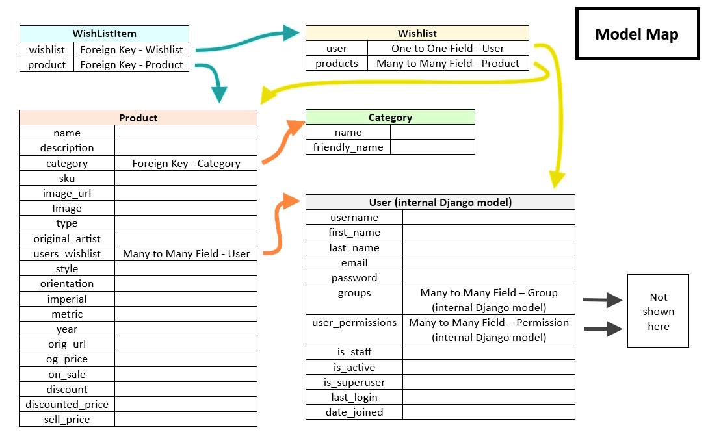

# Eponymous Bosch

This website has been created to sell AI generated art prints. It has been designed with a range of different screen sizes in mind. 

[View the live project here](#)

## Table of Contents

1. [User Experience](#user-experience)
3. [Design](#design)
5. [Features](#features)
6. [Accessibility](#accessibility)
7. [Technologies Used](#technologies-used)
8. [Deployment and Local Development](#deployment-and-local-development)
9. [Testing](#testing)
10. [Credits](#credits)
    
## User Experience

### Initial Discussion

AI is currently very much in the public eye, and Dall-E 2 is no exception to this. With this in mind, it was felt that it may be an interesting venutre to use Dall-E 2 to reimagine various artwork and posters in the style of Hieronymus Bosch; a 15th Century Dutch/Netherlandish painter, most noted for his work 'The Garden of Earthly Delights'.

### User Stories

#### Viewing and Navigation
* View the site on a range of device sizes.
* View a list of art prints. 
* View individual product details.
* Easily view the total of my purchases at any time.

#### Contacting
* Be able to request an art commission

#### Registration and User Accounts
* Easily register for an account
* Easily login or logout
* Easily recover my password in case I forget it
* Receive an email confirmation after registering
* Have a personalised user profile
* Have a personalised wishlist
* Be able to view my past commission requests

#### Sorting and Setting
* Sort the list of available products
* Sort a specific category of product
* Sort multiple categories of products simultaneously
* Search for a product by name or description
* Easily see what I've searched for and the number of results

#### Purchasing and Checkout
* Easily select the quantity of a product when purchasing it
* View items in my bag to be purchased
* Adjust the quantity of individual items in my bag
* Easily enter my payment information
* Feel my personal and payment information is safe and secure
* View an order confirmation after checkout
* Receive an email confirmation after checking out

#### Admin and Store Management
* Add product
* Edit/update a product
* Delete a product
* Create sale prices

## Design

### Early Design Phases / Wireframes

The Wireframes were made via [Paint.net](#).

Due to the colourful nature of the artwork itself, a minimalist design and colour palet was sought, so that it would not clash with any of the artwork displayed. 

This website was designed desktop-first.

### Model Map

This model was used to plan the sale alert function, which ultimately failed:

This represents my current models:

### Colour scheme

The website uses a colour palette.

### Typography

Google Fonts was used to import the following fonts:

*  is a serif font. This is used for the navigation bar and headings.
*  is a sans-serif font. This is used for all other text. 

### Database Schema

It was felt that a relational database was required, as there was a need for the user and art data to be related. 

## Features

The website is made up of 9 pages:

* 

### Index

The index page has the following features:

   

   * 

### All pages have the following features

* 

   

### Future Features

* 

## Accessibility

I have been mindful during coding to ensure that the website is as accessible as possible. I have achieved this by:

* Using semantic HTML.
* Using descriptive alt attributes on images on the site.
* Supplying information for screen readers where there are icons used and no text, such as footer icons.
* Guaranteeing adequate colour contrast throughout the site.

## Technologies Used

### Languages Used

HTML5, CSS3, Python, and JavaScript were used to create this website.

### Frameworks, Libraries & Programs Used

* [Google Fonts](https://fonts.google.com/) was used to import Merriweather and Arimo.
* [Git](https://git-scm.com/) was used for version control by using the Gitpod terminal to commit to Git and Push to GitHub.
* [GitHub](https://github.com/) was used to store the projects' code, and to handle version control.
* [Paint.Net](https://www.getpaint.net/download.html) was used to edit and crop images.
* [Chrome Dev Tools](https://developer.chrome.com/docs/devtools/) was used to troubleshoot and test features and solve issues with responsiveness and styling.
* [Am I Responsive?](https://ui.dev/amiresponsive) was used to show the website on a range of devices.
* [Unicorn Revealer](https://chrome.google.com/webstore/detail/unicorn-revealer/lmlkphhdlngaicolpmaakfmhplagoaln?hl=en-GB) was used for debugging.
* [SQLAlchemy](https://www.sqlalchemy.org/) was used to connect Python code with the database.
* [Psycopg2](https://www.psycopg.org/docs/) was used to connect Python code with the database. 
* [Django](https://www.djangoproject.com/) is a high-level Python web framework.
* [Bootstrap](https://getbootstrap.com/) was used for responsive and pre-designed CSS.
* [PostgreSQL](https://www.postgresql.org/) was the object-relational database system used.
* [ElephantSQL](https://www.elephantsql.com/) was used to host the database.
* [Heroku](https://www.heroku.com/) was used to deploy the website.
* [Dall-E 2](https://openai.com/product/dall-e-2) was used to create the artwork.
* [AI Image Enlarger](https://imglarger.com/Enhancer) was used to tidy up the contrast etc. of the artwork.
* [Flickr](https://www.flickr.com/) was used to host some of the images.
* [Excel](https://www.microsoft.com/en-gb/microsoft-365/excel) was used to create csv files.
* [Convert CSV](https://www.convertcsv.com/csv-to-json.htm) was used to convert csv files to json files.
* [Font Awesome](https://fontawesome.com/) was used for the icons.

## Deployment and Local Development

### Deployment

This project was deployed to Heroku using the following steps:

#### ElephantSQL

1. Navigate to ElephantSQL.com and create a user account, using log in with GitHub.
2. Click “Create New Instance”.
3. Set up your plan. (You can leave the 'tags' field blank.)
4. Select region.
5. Select a data centre near you
6. Then click “Review”.
7. Check your details are correct and then click “Create instance”.
8. Return to the ElephantSQL dashboard and click on the database instance name for this project
9. In the URL section, clicking the copy icon will copy the database URL to your clipboard
10. Leave this tab open, we will come back here later

#### Heroku

1. Log into Heroku.com and click “New” and then “Create a new app”.
2. Choose a unique name for your app, select the region closest to you and click “Create app”.
3. Go to the Settings tab of your new app
4. Click Reveal Config Vars
5. Return to your ElephantSQL tab and copy your database URL
6. Back on Heroku, add a Config Var called DATABASE_URL and paste your ElephantSQL database URL in as the value. Make sure you click “Add.”
7. Add each of your other environment variables except DEVELOPMENT and DB_URL from the env.py file as a Config Var. 
8. Navigate to the “Deploy” tab of your app.
9. In the Deployment method section, select “Connect to GitHub”.
10. Search for your repo and click Connect
11. Optional: You can click Enable Automatic Deploys in case you make any further changes to the project. This will trigger any time code is pushed to your GitHub repository.
12. As we already have all our changes pushed to GitHub, we will use the Manual deploy section and click Deploy Branch. This will start the build process. 
13. Now, we have our project in place, and we have an empty database ready for use. As you may remember from our local development, we still need to add our tables to our database. To do this, we can click the “More” button and select “Run console.”
14. Type python3 into the console and click Run
15. In the terminal that opens, write "from plantplanner import db" and then press enter.
16. In the terminal, write "db.create_all()" and then press enter.
17. Exit the Python terminal, by typing exit() and hitting enter, and close the console. Our Heroku database should now have the tables and columns created from our models.py file.
18. The app should be up and running now, so click the “Open app” button

### Local Deployment

#### How to Fork

To fork the Eponymous Bosch repository:

1) Log in (or sign up) to GitHub.
2) Go to the repository for this project, at [GitHub Repository](#).
3) Click the Fork button in the top right corner.

#### How to Clone

To clone the Eponymous Bosch repository:

1) Log in (or sign up) to GitHub.
2) Go to the repository for this project, at [GitHub Repository](#).
3) Above the list of files, click "Code".
4) Click "Open with GitHub Desktop" to clone and open the repository with GitHub Desktop.
5) Click "Choose..." and, using Windows Explorer, navigate to a local path where you want to clone the repository.
6) Click "Clone".
   
### How to run the server to see the website in the browser:
   In the terminal, type:
      - python3 manage.py runserver

## Testing

Testing was ongoing throughout the entire build. I utilised Chrome developer tools while building to pinpoint and troubleshoot any issues as I went along. Both manual and automated testing was employed. The difference between these two types of tests is that:

* Manual testing is conducted by a person, who is seeing if they can break the product, or otherwise whether it behaves as expected for users.
* Automatic testing is conducted by automation frameworks, or another kind of tool or piece of software. 

I personally tested the page and had 3 people also manually test it on their own devices. For automated testing, I used W3C validator, CSS validator, Python Checker and Lighthouse. 

### W3C Validator

The [W3C HTML Validator](https://validator.w3.org/) was used to validate the HTML on all pages of the website. 

* Results from the  page check.
* Results from the  page check.

### CSS Validator

The [W3C CSS Validator](https://jigsaw.w3.org/css-validator/) was used to validate the CSS in the style.css file.

Results from the .

### JSHint Validator

The [JSHint Validator](https://jshint.com/) was used to validate the JavaScript in the script.js file.

Results from the [check](#).

### Pep8 Validator

The [the CI Python Linter](https://pep8ci.herokuapp.com/) was used to validate the Python code.

* Results from the  check.
* Results from the  check.

### Solved Bugs

| Bug Number  | Expected behaviour | Actual behaviour | Solution |
| ---:        |    :----:          |        :----:    | :---     |
| 1       |  When clicking on the On Sale dropdown under All Products in the nav bar, user sees everything on sale   |  This did not happen  | The model has a property called on_sale that determines the boolean value of on_sale in the Product model. This calculates if an item is on sale based on whether the admin enters a discount or not. So instead of looking for on_sale=True, the code looks for on_sale being greater than 0. So I changed the all_product view section to "if 'on_sale' in request.GET: products = products.filter(discount__gt=0)" |
| 2       | Commissions shown on the my_commissions page should only be those of the user  | Currently showing all user's commissions  | Change part of the my_commissions view code from this -> commissions = Commission.objects.all() to this -> commissions = Commission.objects.filter(user=request.user) |
| ---:        |    :----:          |        :----:    | :---     |

### Known Bugs

| ---:        |    :----:          |        :----:    | :---     |
| ---:        | Subtotal in checkout page shows subtotal of items | It does not  | This piece of code in checkout.html does not work - {{ item.product.price | calc_subtotal:item.quantity }}  |

### Full Testing

To fully test my website, I used Google Chrome Developer Tools to ensure that the page was responsive on all available screen sizes. Testing was performed on a variety of browsers (Chrome, Microsoft Edge, and Firefox) and devices (Gigabyte gaming laptop, iPhone SE, Android one+ 9 mobile, Fair Phone).

#### Links:

Tested each link on every page. Each link worked as expected. 

#### Buttons:

Tested each button on every page. Each button worked as expected. 

#### Forms:

Checked that all forms behaved as expected in terms of:
   * Not submitting when required fields are left blank.
   * Returning success messages when the user successfully submits a form.
   * Not allowing users to enter strings that are too long.

#### Authentication:

The following was tested and found to be working as expected:

* Users can only access these sections and functions of the website if they are logged in -
   * 
* Users cannot view private information about other users, such as user account details. 

#### Database:

The following was tested and found to be working as expected:

* User data is added and persists over time.
* Order history is added and persists over time.
* User is linked to their order history data.
* User data can be edited and deleted from the database.
* On deletion of the user, the order history data associated with that user is also deleted.

## Credits

Thanks are given for the following posts and tutorials:

* [Platform-based Programming's Asignment Walkthrough](https://pbp-fasilkom-ui.github.io/ganjil-2023/en/assignments/tutorial/tutorial-1/) was used for the base code for setting up the wishlist.
* [Funda Web Of It's tutorial on Insert data into database in Django](https://www.fundaofwebit.com/django/insert-data-into-database-in-django#:~:text=To%20insert%20data%2C%20using%20forms,the%20classname%20as%20shown%20below.&text=Open%20the%20views.py%20file,given%20in%20the%20path%20above.&text=%23%20Create%20your%20views%20here.) was used to understand how to create a wishlist button to send the data to the database.
* [Coding Ninja's Django Model Form tutorial](https://www.codingninjas.com/codestudio/library/django-model-form) was used for the basis of the contact / commission form.
* [Geeks for Geeks tutorial on Overriding the save method in django models](https://www.geeksforgeeks.org/overriding-the-save-method-django-models/) helped me understand how to create the save function in the product model for when products are on sale.
* [Monkut's reply in Stack Overflow post about showing custom model validation exceptions in the Django admin site](https://stackoverflow.com/questions/2177720/showing-custom-model-validation-exceptions-in-the-django-admin-site) helped me understand how to raise validation exceptions for my product model when writing the sale functions. 

### Code Used

* [Code Institute's 'Boutique Ado' walkthrough](https://learn.codeinstitute.net/courses/course-v1:CodeInstitute+FSF_102+Q1_2020/courseware/4201818c00aa4ba3a0dae243725f6e32/d3188bf68530497aa5fba55d07a9d7d7/) was used as the starting point for this project.
* [Ajmal Aamir's](https://stackoverflow.com/questions/56580696/how-to-implement-add-to-wishlist-for-a-product-in-django) model code in this Stack Overflow post was used as a basis for the wishlist model.
* [Harry Dhillon's Nourish and Lift](https://github.com/Harry-Leepz/Nourish-and-Lift/blob/main/wishlist/views.py) code was used as a basis for the wishlist.
* [Mahammadhusain Kadiwala's](https://stackoverflow.com/questions/73813646/django-models-to-calculate-discount) code was used as a basis for the sale information in the product model.
* [Timmy O'Mahony's](https://stackoverflow.com/questions/6195424/how-to-insert-a-checkbox-in-a-django-form) code was used and edited for the wishlist sales alert checkbox.

### Content

Content for the website was made by Rossanne Hamilton.

### Media Used

* [StockSnap's image](https://pixabay.com/photos/wall-picture-frame-display-interior-2558279/) on Pixabay was used for the background image of Starry Night and Water Lillies. 
* [Uroburos's image](https://pixabay.com/photos/image-painting-art-gallery-painter-1053852/) on Pixabay was used for the background image of the Mona Lisa. 
* [Uroburos's image](https://pixabay.com/photos/image-painting-piece-the-museum-1053849/) on Pixabay was used for the background image of The Scream. 
* [Counselling's image](https://pixabay.com/photos/oil-painting-picture-frame-492639/) on Pixabay was used for the background image of Ophelia. 
* [Romka's image](https://www.pexels.com/photo/a-single-gold-framed-painting-on-the-wall-2951525/) on Pexels was used for the background image of Dogs Playing Poker. 
* [Google Font Oranienbaum](https://fonts.google.com/specimen/Oranienbaum?preview.text=METROPOLIS&preview.text_type=custom&category=Serif) was used for the font on the Metropolis poster. 
* [Tim Mossholder's image](https://www.pexels.com/photo/white-and-black-strap-on-green-painted-wall-2096622/) on Pexels was used for the background image of Metropolis. 
* [Google Font's Metal Mania](https://fonts.google.com/specimen/Metal+Mania?preview.text=JAWS&preview.size=96&preview.text_type=custom&query=metal+mania) was used for the font on Jaws. 
* [Google Font's Piedra](https://fonts.google.com/specimen/Metal+Mania?preview.text=JAWS&preview.size=96&preview.text_type=custom&query=metal+mania) was used for the font on Hang in There. 
* [Olga Lioncat's image](https://www.pexels.com/photo/palm-leaves-near-the-yellow-wall-7245622/) on Pexels was used for the background image of Hang in There. (The colour was heavily edited.)
* [Cottonbro Studio's image](https://www.pexels.com/photo/man-in-white-crew-neck-shirt-4065136/) on Pexels was used for the background image of Le Chat Noir.
* [SHVETS Production's image](https://www.pexels.com/photo/red-and-blue-curling-stones-in-close-up-photography-7561421/) on Pexels was used for the background image of Rosie the Riveter. (The colour was heavily edited.)
* [Google Font's Dancing Script](https://fonts.google.com/specimen/Dancing+Script?category=Handwriting&preview.text=(eponymous)&preview.text_type=custom) was used for part of the logo's font. 
* [Google Font's Big Shoulders Stencil Text](https://fonts.google.com/specimen/Big+Shoulders+Stencil+Text?category=Handwriting&preview.text=BoscH&preview.text_type=custom) was used for part of the logo's font. 
* [Karolina Grabowska's image](https://www.pexels.com/photo/black-and-white-photo-frame-5978717/) on Pexels was used for the background image of Relativity. (The colour was edited.)
* [Google Font's Big Shoulders Text](https://fonts.google.com/specimen/Big+Shoulders+Text?query=Patric+King) was used for the text body.
* [Wikipedia](https://www.wikipedia.org/) was used for som of the text discussing the artwork, and most of the links directing the user to the original.
* [Microsoft Excel](https://www.microsoft.com/en-gb/microsoft-365/excel) was used to create csv files.
* [Convert CSV](https://www.convertcsv.com/csv-to-json.htm) was used to convert the csv files to json files.
* [9699186's image](https://pixabay.com/photos/frame-mockup-flatlay-plant-3681646/) on Pixabay was used for the background image of The Wounded Deer.
* [Eva Bronzini's image](https://www.pexels.com/photo/photo-of-a-blank-picture-frame-7967320/) on Pixabay was used for the background image of The Lovers II.
* 
* 

### Acknowledgements

I would like to acknowledge the following people who helped me along the way in completing my fourth milestone project:

- My mentor Mitko Bachvarov for helpful feedback and sharing links for further learning.
- My tutor Robert Mclaughlin for helpful feedback and sharing links for further learning.
- Chris Mugridge and Maya Irish for user and device testing.
- Thomas Muat for helping me understand why the on_sale filter wasn't working in the nav bar.