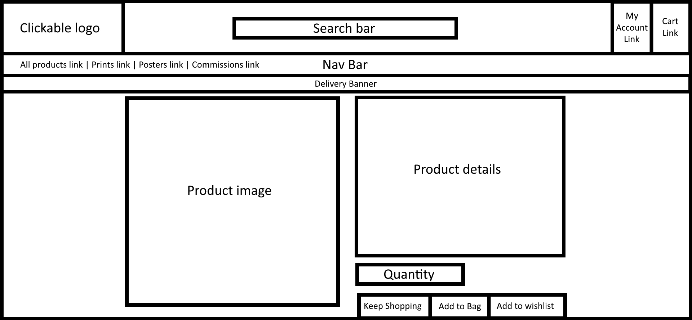
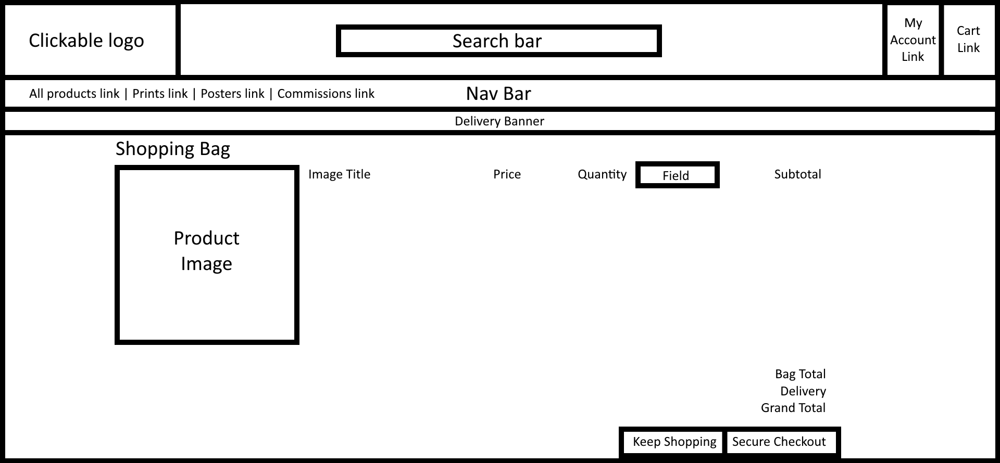
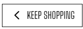
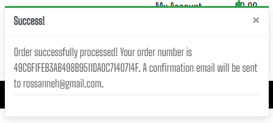
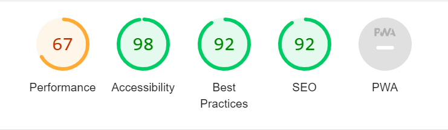

# **Eponymous Bosch**

This website has been created to sell AI-generated art prints for a European target group. Therefore, metric sizes have been focused on when the user requests a commission. It has been designed with a range of different screen sizes in mind. 

[View the live project here](https://eponymous-bosch-b9b71a6bff59.herokuapp.com/)

---
 

## **Table of Contents**

1. [User Experience](#user-experience)
3. [Design](#design)
5. [Features](#features)
6. [Accessibility](#accessibility)
7. [Technologies Used](#technologies-used)
8. [Deployment and Local Development](#deployment-and-local-development)
9. [Testing](#testing)
10. [Credits](#credits)

---
 
    
## **User Experience**
 

### **Initial Discussion**

AI is currently very much in the public eye, and Open AI's Dall-E 2 is no exception to this. With this in mind, it was felt that it may be an interesting venture to use Dall-E 2 to reimagine various artwork and posters in the style of Hieronymus Bosch; a 15th Century Dutch/Netherlandish painter, most noted for his work 'The Garden of Earthly Delights'.
  

### **User Stories**

#### **Viewing and Navigation**
* View the site on a range of device sizes.
* View a list of art prints. 
* View individual product details.
* Easily view the total of my purchases at any time.
* View only the products I would like to buy in the future.
* View my past commission requests and their status.

 

#### **Contacting**
* Be able to request an art commission.
* Have a choice of being emailed if an item on my wishlist goes on sale.

 

#### **Registration and User Accounts**
* Easily register for an account.
* Easily log in or log out.
* Easily recover my password in case I forget it.
* Receive an email confirmation after registering.
* Have a personalised user profile.
* Have a personalised wishlist.
* Be able to view my past commission requests.

 

#### **Sorting and Setting**
* Sort the list of available products.
* Sort a specific category of product.
* Sort multiple categories of products simultaneously.
* Search for a product by name or description.
* Easily see what I've searched for and the number of results.
* Sort based on what is currently on sale.

 

#### **Purchasing and Checkout**
* Easily select the quantity of a product when purchasing it.
* View items in my bag to be purchased.
* Adjust the number of individual items in my bag.
* Easily enter my payment information.
* Feel my personal and payment information is safe and secure.
* View an order confirmation after checkout.
* Receive an email confirmation after checking out.

 

#### **Admin and Store Management**
* Add product.
* Edit/update a product.
* Delete a product.
* Create sale items including prices, start dates, and end dates (on the Django admin page)

---
 

## **Design**
 

### **Wireframes**

The wireframes are mostly adapted versions of the Boutique Ado walkthrough.

Index

 

Products

 

Product Detail

 

Commissions

 

Product Management

 

My Profile

 

Wishlist

 

My Commissions

 

Commission Success

 

Logout

 

Register

 

Sign-in

 

Shopping Bag

 

Checkout

 

Checkout Success

 

 

### **Colour Scheme**

Due to the colourful nature of the artwork itself, a minimalist design and colour palette were sought, so that it would not clash with any of the artwork displayed. 

 

### **Typography**

Google Fonts was used to import the following fonts:

*  is a serif font. This is used for the navigation bar and headings.
*  is a sans-serif font. This is used for all other text. 

 

### **Models**

This map represents the current models in the relational database, apart from the models that were not changed from the Boutique Ado walkthrough and are not referenced by the new code. Those in yellow have not been modified since the Boutique Ado walkthrough. Those in green have either been heavily modified or are completely new. ('Products' was heavily modified, Commission and Wishlit are new.):

---
 

## **Features**

The website is made up of 15 pages:

* Index
* Products
* Product Detail
* Commissions
* Product Management
* My Profile
* Wishlist
* My Commissions
* Commission Success
* Logout
* Register
* Sign-in
* Shopping Bag
* Checkout
* Checkout Success

 

### **Index**

The index page has:

   

   
A "Shop Now" button, which takes the user to the "All Products" page

   

   
     

 

### **Products**

The Products page has the following features:

   

   
A list of products, which, when clicked, takes the user to the detail page of that specific product. If the product is on sale, the price is updated and the text is red, with additional text labeling it as on sale.

   

   

    

   

   
If the user is a superuser, then at the bottom of each product are links to either edit or delete the product.

   

   

    

   

   
Text which lets the user know how many products there are in the category they are browsing. When the user is filtering products, this also shows a link to "Products Home"

   

   

    

   

   
A dropdown box with the ability to sort by price (low to high), price (high to low), name (a-z), name (z-a), year of original (past-present), year of original (present - past). The year of the original denotes the year that the artwork was made that the piece was based on.

   

   

    

   

   
Category boxes appear when you are seeing the product page in any view other than 'all products'. They show the user which categories they are currently viewing and can be clicked on to take the user to a specific category.

   

   

    

   

   
A scroll-up button on the bottom-right-hand-side of the page, which when clicked, will automatically scroll the page up to the top.

   

   

    

 

### **Product Detail**

The Product Detail page has the following features:

   

   
When clicking on the product image, it opens in a new tab for a clearer view.

   

   

    

   

   
If the product is on sale, the price is updated, and the text turns red. The red text also appears to the right to say that the product is on sale.

   

   

    

   

   
If the user is a superuser, two links appear giving the user the ability to edit or delete the product.

   

   

    

   

   
If the user would like more than one of the products, they can adjust the quantity. The maximum quantity is 3.

   

   

    

   

   
A keep shopping button that takes the user back to the products page to view all products.

   

   

    

   

   
A button that will add the desired quantity of the product to the user’s checkout cart.

   

   

    

   

   
A button that will add the product to the logged-in user’s wishlist. This button is only shown if the user is logged in.

   
   
   

    

 

### **Commissions**

   

   
The Commissions page has a form that the user can fill in to request a commission.

   
   
   

    

 

### **Commission Success**

   

   
This page is shown when the user successfully submits a commission form. It includes links to their commission page, their wishlist, and the all-products page. It should be noted that the commission form is only available to logged-in users. 

   
   
   

    

 

### **Product Management** 

   

   
The Product Management page is only available to logged-in superusers and has a form that will allow the user to add a product.

   
   
   

    

 

### **My Profile**

The My Profile page has the following features:

   

   
A form where the user can update their personal information, which is then auto-filled on the checkout form.

   
   
   

    

   

   
A button that takes the user to their wishlist.

   
   
   

    

   

   
A button that takes the user to their commissions.

   
   
   

    

   

   
A section that shows the user their order history.

   
   
   

    

 

### **Wishlist**

The Wishlist page has the following features:

    

   

   
A section that tells the user how many items they have on their wishlist.

   
   
   

    

   

   
A small form the user can submit consent to be automatically emailed when one of their wished-for items goes on sale. This changes to remove consent as an option if they have given consent previously.

   
   
   
   

    

   

   
A list of wishlist items that the user has saved. Each item is clickable and takes the user to the specific product detail page.

   
   
   

    

   

   
A button underneath each item, allowing the user to remove it from their wishlist.

   
   
   

    

 

### **My Commissions**

The My Commissions page has the following features:

   

   
A section that shows the user how many pieces of art they have commissioned.

   
   
   

    

   

   
Each commission the user has requested has its own section. This includes a status that can be updated by the administrator on the Django Admin page to let the user know where they are in the commission process. These are ordered by the most recent date.

   
   
   

    

 

### **Logout**

   

   
The Logout page has a cancel button which takes the user back to the product page, and a sign-out button, which signs the user out.

   
   
   

    

 

### **Register**

   

   
The Sign Up page has the following features:

   
   * A link to take the user to the sign-in page if they already have an account. 
   * A form for the user to sign up if they don't already have an account. 
   * This page is only seen if the user is not signed in.

      
   
   

    

 

### **Sign In** 

   

   
The Sign In page has the following features:

   
   * A login button that takes the user to the login page in case they already have an account.
   * A form for the user to input the necessary details to create an account.

      
   
   

    

 

### **Shopping Bag***

The Shopping bag page has the following features:

   

   
The details of the products being bought, with an option to update the amount or remove each product.

   
   
   
   

    

   

   
 The details of the total and delivery price, as well as information on how much extra the user should spend to get free postage.
   / A button to return the user to the products page.
   / A button to continue to the checkout.

   
   
   
   

    

 

### **Checkout**

The Checkout page has the following features:

   

   
A form for the user details needed to check out.

   
   
   
   

    

   

   
The order summary / A button to send the user back to be able to adjust their bag / A button to submit their order

   
   
   
   

    

 

### **Checkout Success**

The Checkout success page has the following feature:

   

   
Information about the user order

   
   
   
   

    

 

### **All pages have the following features**

   

   
A logo that when clicked takes the user back to the index page.

   
   
   
   

    

   

   
A search function

   
   
   
   

    

   

   
Links to three versions of the products page - all products/prints/posters, which themselves have dropdowns to further filter those pages. / A link to the commission’s page, which is only shown when the user is logged in.

   
   
   
   

    

   

   
A drop-down menu for the user account. Which only shows 'log in' and 'register' if the user is not logged in, but shows 'product management', 'my profile', 'my wishlist', 'my commissions' and 'logout'.
   / A link to the user’s shopping cart

   
   
   
   

    

 

### **Toasts & Messages**

Many messages are included to alert the user that they have accomplished an action. Such as:

   

   
When adding a product to their checkout bag.

   
   
   
   

    

   

   
Successfully placing an order.

   
   
   
   

    

   

   
Adding an item to their wishlist.

   
   
   
   

    

   

   
Removing an item from their wishlist.

   
   
   
   

    

   

   
Updating their consent preferences for being emailed when an item on their wishlist goes on sale.

   
   
   
   

    

 

### **Product Model**

The discounted price of a product is automatically calculated based on the user’s input on the admin page. When the user inputs the discount percentage, this:

* Changes the selling price of the product, based on the percentage added
* Changes the 'on sale' variable to 'True', which in turn changes the HTML in the product and product detail pages
* If the user neglects to enter a sale start and end date, these are automatically added. The sale start date in this case will be the current date, and the end sale date will be a week from the current date
* If the user adds dates but no discount, they are shown a customised validation error explaining this
* If the user adds a sale end date that is earlier than the start sale date, they are shown a customised validation error
* If the user ends the sale early by changing the discount percentage to zero without changing the sale start and end dates, the dates are automatically removed
* When the sale ends, the dates are automatically removed, as is the discount. Therefore resetting the product to the original price and setting 'on sale' to False

 

### **Future Features**

* The commission form to automatically fill in the name and email of the logged-in user
* The checkout form to show and automatically fill in the name of the logged-in user
* Improve the responsiveness of a few of the pages in the mobile view 
* Email to be a real email, not just be printed in the terminal

---

 

## **Accessibility**

I have been mindful during coding to ensure that the website is as accessible as possible. I have achieved this by:

* Using semantic HTML.
* Using descriptive alt attributes on images on the site.
* Supplying information for screen readers where there are icons used and no text, such as footer icons.
* Guaranteeing adequate colour contrast throughout the site.

---
 

## **Technologies Used**

 

### **Languages Used**

HTML5, CSS3, Python, and JavaScript were used to create this website.

 

### **Frameworks, Libraries & Programs Used**

* [Google Fonts](https://fonts.google.com/) was used to import Merriweather and Arimo.
* [Git](https://git-scm.com/) was used for version control by using the Gitpod terminal to commit to Git and Push to GitHub.
* [GitHub](https://github.com/) was used to store the projects' code, and to handle version control.
* [Paint.Net](https://www.getpaint.net/download.html) was used to edit and crop images.
* [Chrome Dev Tools](https://developer.chrome.com/docs/devtools/) was used to troubleshoot and test features and solve issues with responsiveness and styling.
* [Am I Responsive?](https://ui.dev/amiresponsive) was used to show the website on a range of devices.
* [Unicorn Revealer](https://chrome.google.com/webstore/detail/unicorn-revealer/lmlkphhdlngaicolpmaakfmhplagoaln?hl=en-GB) was used for debugging.
* [SQLAlchemy](https://www.sqlalchemy.org/) was used to connect Python code with the database.
* [Psycopg2](https://www.psycopg.org/docs/) was used to connect Python code with the database. 
* [Django](https://www.djangoproject.com/) is a high-level Python web framework.
* [Bootstrap](https://getbootstrap.com/) was used for responsive and pre-designed CSS.
* [PostgreSQL](https://www.postgresql.org/) was the object-relational database system used.
* [ElephantSQL](https://www.elephantsql.com/) was used to host the database.
* [Heroku](https://www.heroku.com/) was used to deploy the website.
* [Dall-E 2](https://openai.com/product/dall-e-2) was used to create the artwork.
* [AI Image Enlarger](https://imglarger.com/Enhancer) was used to tidy up the contrast etc. of the artwork.
* [Flickr](https://www.flickr.com/) was used to host some of the images.
* [Excel](https://www.microsoft.com/en-gb/microsoft-365/excel) was used to create CSV files.
* [Convert CSV](https://www.convertcsv.com/csv-to-json.htm) was used to convert CSV files to JSON files.
* [Font Awesome](https://fontawesome.com/) was used for the icons.
* [Lucid](https://lucid.app/) was used to map the models.
* [Amazon Web Services](https://aws.amazon.com/) was used to host the images for the Heroku-hosted site.
* [Batch Compress](https://batchcompress.com/en) was used to compresss image files.
* [Bulk Resize Photos](https://bulkresizephotos.com/) was used to resize image files and put them in a different file format.
* [RespImageLint](https://ausi.github.io/respimagelint/) was used to see how the images needed to be changed to optimise the page.

---

 

## **Deployment and Local Development**

 

### **Deployment**

This project was deployed to Heroku using the following steps:

 

#### **ElephantSQL**

1. Navigate to ElephantSQL.com and create a user account, by using the log-in with GitHub option.
2. Click “Create New Instance”.
3. Set up your plan. (You can leave the 'tags' field blank.)
4. Select a region.
5. Select a data centre near you
6. Then click “Review”.
7. Check your details are correct and then click “Create instance”.
8. Return to the ElephantSQL dashboard and click on the database instance name for this project
9. In the URL section, clicking the copy icon will copy the database URL to your clipboard
10. Leave this tab open, we will come back here later

 

#### **Heroku**

1. Log into Heroku.com, click “New” and then “Create a new app”.
2. Choose a unique name for your app, select the region closest to you, and click “Create app”.
3. Go to the Settings tab of your new app
4. Click Reveal Config Vars
5. Return to your ElephantSQL tab and copy your database URL
6. Back on Heroku, add a Config Var called DATABASE_URL and paste your ElephantSQL database URL in as the value. Make sure you click “Add.”
7. Add each of your other environment variables except DEVELOPMENT and DB_URL from the env.py file as a Config Var. 
8. Navigate to the “Deploy” tab of your app.
9. select “Connect to GitHub” in the Deployment method section.
10. Search for your repo and click Connect
11. Optional: You can click Enable Automatic Deploys in case you make any further changes to the project. This will trigger any time code is pushed to your GitHub repository.
12. As we already have all our changes pushed to GitHub, we will use the Manual Deploy section and click Deploy Branch. This will start the build process. 
13. Now, we have our project in place, and we have an empty database ready for use. As you may remember from our local development, we still need to add our tables to our database. To do this, we can click the “More” button and select “Run console.”
14. Type python3 into the console and click Run
15. In the terminal that opens, write "from # import db" and then press enter.
16. In the terminal, write "db.create_all()" and then press enter.
17. Exit the Python terminal, by typing exit() and hitting enter, and close the console. Our Heroku database should now have the tables and columns created from our models.py file.
18. The app should be up and running now, so click the “Open app” button

 

### **Local Deployment**

 

#### **How to Fork**

To fork the Eponymous Bosch repository:

1) Login (or sign up) to GitHub.
2) Go to the repository for this project, at [GitHub Repository](https://github.com/Lithill/Eponymous-Bosch).
3) Click the Fork button in the top right corner.

 

#### **How to Clone**

To clone the Eponymous Bosch repository:

1) Login (or sign up) to GitHub.
2) Go to the repository for this project, at [GitHub Repository](https://github.com/Lithill/Eponymous-Bosch).
3) Above the list of files, click "Code".
4) Click "Open with GitHub Desktop" to clone and open the repository with GitHub Desktop.
5) Click "Choose..." and, using Windows Explorer, navigate to a local path where you want to clone the repository.
6) Click "Clone".

---

 

## **Testing**

Testing was ongoing throughout the entire build. I utilised Chrome developer tools while building to pinpoint and troubleshoot any issues as I went along. Both manual testing and validation was employed.  

I tested the page and had 3 people also manually test it on their own devices. For validation, I used the W3C validator, CSS validator, Python Linter, JSHint validator, and Lighthouse. 

 

### **Validation**

 

#### **W3C Validator**

The [W3C HTML Validator](https://validator.w3.org/) was used to validate the HTML on all pages of the website. 

* Results from the [bag](static/images/readme/validation/html/bag.jpg) page check.
* Results from the [checkout](static/images/readme/validation/html/checkout.jpg) page check.
* Results from the [checkout success](static/images/readme/validation/html/checkout_success.jpg) page check.
* Results from the [commission](static/images/readme/validation/html/commission.jpg) page check.
* Results from the [commission success](static/images/readme/validation/html/commission_success.jpg) page check.
* Results from the [my commission](static/images/readme/validation/html/my_commissions.jpg) page check.
* Results from the [index](static/images/readme/validation/html/index.jpg) page check.
* Results from the [products](static/images/readme/validation/html/products.jpg) page check.
* Results from the [product detail](static/images/readme/validation/html/product_detail.jpg) page check.
* Results from the [profile](static/images/readme/validation/html/my_profile.jpg) page check.
* Results from the [sign up](static/images/readme/register.jpg) page check.
* Results from the [log out](static/images/readme/validation/html/logout.jpg) page check.
* Results from the [log in](templates/allauth/account/login.html) page check.
* Results from the [email confirm](static/images/readme/validation/html/email_confirm.jpg) page check.
* Results from the [wishlist](static/images/readme/validation/html/wishlist.jpg) page check.

 

#### **CSS Validator**

The [W3C CSS Validator](https://jigsaw.w3.org/css-validator/) was used to validate the CSS in the style.css file.

* Results from the [checkout](static/images/readme/validation/css/checkout_css.jpg) css.
* Results from the [profile](static/images/readme/validation/css/profile_css.jpg) css.
* Results from the [base](static/images/readme/validation/css/base.jpg) css.

 

#### **JSHint Validator**

The [JSHint Validator](https://jshint.com/) was used to validate the JavaScript in the script.js file. I needed to use the following code at the top for the proper validation to be shown:   

`/*jshint esversion: 6 */`
      
I also needed to add the following code so that the use of jquery did not show $ as an undefined variable:

 `/*globals $:false */`

* Results from the [checkout](static/images/readme/validation/js/stripe_elements.jpg) js. This shows 'Stripe' as being an undefined variable, but as it is coming from another script, it can be safely ignored.
* Results from the [profiles](static/images/readme/validation/js/countryfield.jpg) js.

 

#### **Pep8 Validator**

The [CI Python Linter](https://pep8ci.herokuapp.com/) was used to validate the Python code. As there are so many files, I will order them by app.

 

**Bag**

* Results from the [apps.py](static/images/readme/validation/py/bag_apps.jpg) check.
* Results from the [contexts.py](static/images/readme/validation/py/bag_contexts.jpg) check.
* Results from the [urls.py](static/images/readme/validation/py/bag_urls.jpg) check.
* Results from the [views.py](static/images/readme/validation/py/bag_views.jpg) check.

 

**Checkout**

* Results from the [init.py](static/images/readme/validation/py/checkout_init.jpg) check.
* Results from the [admin.py](static/images/readme/validation/py/checkout_admin.jpg) check.
* Results from the [apps.py](static/images/readme/validation/py/checkout_apps.jpg) check.
* Results from the [forms.py](static/images/readme/validation/py/checkout_forms.jpg) check.
* Results from the [models.py](static/images/readme/validation/py/checkout_models.jpg) check.
* Results from the [signals.py](static/images/readme/validation/py/checkout_signals.jpg) check.
* Results from the [urls.py](static/images/readme/validation/py/checkout_urls.jpg) check.
* Results from the [views.py](static/images/readme/validation/py/checkout_views.jpg) check.
* Results from the [webhook_handler.py](static/images/readme/validation/py/checkout_webhook_handler.jpg) check.
* Results from the [webhooks](static/images/readme/validation/py/checkout_webhooks.jpg) check.

 

**Contact**

* Results from the [admin](static/images/readme/validation/py/contact_admin.jpg) check.
* Results from the [apps](static/images/readme/validation/py/contact_apps.jpg) check.
* Results from the [forms](static/images/readme/validation/py/contact_forms.jpg) check.
* Results from the [models](static/images/readme/validation/py/contact_models.jpg) check.
* Results from the [urls](static/images/readme/validation/py/contact_urls.jpg) check.
* Results from the [views](static/images/readme/validation/py/contact_views.jpg) check.

 

**Eponymous Bosch**

* Results from the [asgi](static/images/readme/validation/py/base_asgi.jpg) check.
* Results from the [settings](static/images/readme/validation/py/base_settings.jpg) check.
* Results from the [urls](static/images/readme/validation/py/base_urls.jpg) check.
* Results from the [wsgi](static/images/readme/validation/py/base_wsgi.jpg) check.

 

**Home**

* Results from the [apps](static/images/readme/validation/py/home_apps.jpg) check.
* Results from the [urls](static/images/readme/validation/py/home_urls.jpg) check.
* Results from the [views](static/images/readme/validation/py/home_views.jpg) check.

 

**Products**

* Results from the [admin](static/images/readme/validation/py/products_admin.jpg) check.
* Results from the [apps](static/images/readme/validation/py/products_apps.jpg) check.
* Results from the [forms](static/images/readme/validation/py/products_forms.jpg) check.
* Results from the [models](static/images/readme/validation/py/products_models.jpg) check.
* Results from the [urls](static/images/readme/validation/py/products_urls.jpg) check.
* Results from the [views](static/images/readme/validation/py/products_views.jpg) check.
* Results from the [widgets](static/images/readme/validation/py/products_widgets.jpg) check.

 

**Profiles**

* Results from the [apps](static/images/readme/validation/py/profiles_apps.jpg) check.
* Results from the [forms](static/images/readme/validation/py/profiles_forms.jpg) check.
* Results from the [models](static/images/readme/validation/py/profiles_models.jpg) check.
* Results from the [urls](static/images/readme/validation/py/profiles_urls.jpg) check.
* Results from the [views](static/images/readme/validation/py/profiles_views.jpg) check.

 

**Wishlist**

* Results from the [admin](static/images/readme/validation/py/wishlist_admin.jpg) check.
* Results from the [apps](static/images/readme/validation/py/wishlist_apps.jpg) check.
* Results from the [email](static/images/readme/validation/py/wishlist_email.jpg) check.
* Results from the [forms](static/images/readme/validation/py/wishlilst_forms.jpg) check.
* Results from the [models](static/images/readme/validation/py/wishlist_models.jpg) check.
* Results from the [urls](static/images/readme/validation/py/wishlist_urls.jpg) check.
* Results from the [views](static/images/readme/validation/py/wishlist_views.jpg) check.

And finally:

* Results from the [manage.py](static/images/readme/validation/py/manage.jpg) check.

 

#### **Lighthouse**

Lighthouse in Google Dev Tools was used to check performance, accessibility, best practices and search engine optimisation.

I had difficulty improving the mobile lighthouse scores for the deadline, although I understand that they are very imortant for the user experience. This is something that I will continue to work on after the work has been marked. 

   

   
Index Page results

   The original results were improved by adding a meta tag with name and description to the base.html.

   Mobile

   
   
   Desktop
   
   

   

    

   

   
Products Page results

   The results were improved by making the bulk of the images webp, removing the ability to click on a product image and see it displayed larger, and resizing the image files.

   Mobile

   

   Desktop

   

   

    

   

   
Product Detail Page results

   Mobile

   

   Desktop

   

   

    

   

   
Commissions Page results

   Mobile

   

   Desktop

   

   

    

   

   
Add Product Page results

   Lighthouse warned that form elements do not have associated labels, so I created the form in the way the commission form was made, fixed the html validation issues and then entered the image_url field without using crispy forms.

   Mobile

   

   Desktop

   

   

    

   

   
My Profile Page results

   Mobile

   

   Desktop

   

   

    

   

   
Wishlist Page results

   Mobile

   

   Desktop

   

   

    

   

   
My Commissions Page results

   Mobile

   

   Desktop

   

   

    

   

   
Commission Success Page results

   Mobile

   

   Desktop

   

   

    

   

   
Logout Page results

   Mobile

   

   Desktop

   

   

    

   

   
Register Page results

   Mobile

   

   Desktop

   

   

    

   

   
Sign-in Page results

   Mobile

   

   Desktop

   

   

    

   

   
Shopping Bag Page results

   Mobile

   

   Desktop

   

   

    

   

   
Checkout Page results

   Mobile

   

   Desktop

   

   

    

   

   
Checkout Success Page results

   Mobile

   

   Desktop

   

   

    

 

### **Manual Testing**

To fully test my website, I used Google Chrome Developer Tools to ensure that the pages were responsive enough on all available screen sizes. Testing was performed on a variety of browsers (Chrome, Microsoft Edge, and Firefox) and devices (Gigabyte gaming laptop, iPhone SE, Android one+ 9 mobile, Fair Phone).

 

#### **Links:**

| Expected | Test Performed | Result |
| :---:    |    :----:      | :---:  |
| That the user will be taken to the right page when clicking on links | Clicked on every link to make sure that it took the user to the right page | Passed |

 

#### **Buttons:**

| Expected | Test Performed | Result |
| :---:    |    :----:      | :---:  |
| That each button will do what the user expects it to | Clicked on every button to make sure that it worked as expected | Passed |

 

#### **Forms:**

| Expected | Test Performed | Result |
| :---:    |    :----:      | :---:  |
| The form will not submit when required fields are left blank | Checked every form to see if it would be submitted if any of the required fields were left blank | Passed |
| The user sees a success message when having successfully submitted a form | Successfully submitted all forms to check if they all had success messages | Passed |
| The form will not submit when input types and lengths/amounts aren't appropriate | Tested every form field that takes a specific input type to see if it would submit with an undesired input type | Passed |

 

#### **Authentication:**

| Expected | Test Performed | Result |
| :---:    |    :----:      | :---:  |
| Non-logged-in users cannot see or access the parts of the site that are off-limits to them, and vice versa. | I logged in and out and on both occassions I checked to see what options were available to the user | Passed |
| Users cannot view private information about other users, such as user account details, wishlists, carts, or commissions. |    I logged in as different users with different wishlists and commission requests, to check if either user could see the details of the other | Passed |

 

#### **Database:**

| Expected | Test Performed | Result |
| :---:    |    :----:      | :---:  |
| User data is added and persists over time, including order history, commissions and wishlist. | Added multiple users with different data and checked that throughout logging in and out, and over the course of weeks, the data remained the same | Passed |
| User is linked to their order history, wishlist, and commission data | I made multiple user accounts with different data, and all users can see their own data | Passed |
| User data can be edited and deleted from the database. | I tested that when deleting a user and then reestablishing them, none of their previous data is visible in their account. I also edited data such as user delivery details, and deleted items off the wishlist | Passed |
| Calculations in the models to automatically assign variables to work as expected. | All calculations the model made were independently verified by manipulating the data and checking the results. This focused mostly around sales | Passed |

 

#### **Sale Function**

| Expected | Test Performed | Result |
| :---:    |    :----:      | :---:  |
| If the user is looking at a product that is on sale, and the product is then taken off sale if the user adds it to their cart without refreshing the page, the product will revert to the original price. | Opened the product detail page of a sale item. Took the item off sale. Without refreshing the product detail page, I added the item to my cart. Doing this showed that the item had reverted back to its pre-sale price. | Passed |

 

#### **Checkout**

| Expected | Test Performed | Result |
| :---:    |    :----:      | :---:  |
| Adding, editing, and removing products from the bag work as expected.  | I added, edited and removed products from the bag | Passed |
| Users’ correct details auto-fill in the checkout form. | Checked that the same details from the users profile are the ones that are auto-filling the checkout form. I also checked that editing these details will change those on the form. | Passed |
| Stripe payment goes through without any problems. | I made several orders, which all went through fine. I then checked the Stripe dashboard to make sure it was going through on that side too | Passed |
| The webhook is works so that if the user were to lose connection or close their browser before the transaction completes, the order still goes through and they are automatically emailed. | I submited the checkout form but closed the tab before it finished loading. The user still got charged, sent an automatic email, and the order was logged on the system and in their order history | Passed |

 

#### **Wishlist**

| Expected | Test Performed | Result |
| :---:    |    :----:      | :---:  |
| Adding and removing products from the wishlist work as expected. | I tested in different user accounts that I could add and remove products from the wishlist | Passed |
| The email is sent as expected when a user’s wished-for item goes on sale.  | I tested on several user accounts with several different items by adding an item to users wishlists, checking some of their consent boxes, and seeing if only those who consented got an email for the item that just went on sale, if it was in their wishlist | Passed |
| The user can control whether the above happens by turning their consent on or off on their wishlist page. | This was tested for in the test above | Passed |

 

#### **Products**

| Expected | Test Performed | Result |
| :---:    |    :----:      | :---:  |
| The sorting and filtering functions work appropriately. | I clicked on each sort and filter function and checke to see if they displayed the right products and in the order expected | Passed |
| They can be added from the product management page. | I created several products using the management page, and checked to see that they showed up in the admin and on the website in the appropriate places. | Passed |
| They can be edited or deleted by logged-in superusers from the products or product detail pages. | I edited and deleted several products as a superuser in both the 'all products' and 'product detail' pages | Passed |

 

#### **Commissions**

| Expected | Test Performed | Result |
| :---:    |    :----:      | :---:  |
| They can be added to the database via the commission’s form. | I submitted many commission forms, which then displayed on botht eh admin page and the user's 'my commissions' page | Passed`` |
| They appear on the 'My Commissions' page, in order of when they were added, with the recently added being at the top. | I added several commissions to a few different users, and all of them had their commissions appear in the correct order | Passed |
| The admin can change the status on the Django admin page, which will change the status on the 'My Commissions' page. | I changed the status on the admin page for several commissions, and each showed this change on the users 'My Commissions' pages. | Passed |

 

#### **Search**

| Expected | Test Performed | Result |
| :---:    |    :----:      | :---:  |
| The search function works as expected. | I searched for a wide variety of artwork based on different parts of their products pages, and this worked as expected. | Passed |

 

#### **Profile**

| Expected | Test Performed | Result |
| :---:    |    :----:      | :---:  |
| Shows the user’s editable details. | I checked on several users profiles that their details were editable. | Passed |
| Shows the users order history | I checked on several users profiles that their orders were all visible in their order history after making a variety of orders through their accounts | Passed |

 

### **User Testing**

| User | Device | Problem | Screenshot |
| :---:        |    :----:          |        :----:    | :---:     |
| MI | Fair Phone | Can't see the number in the quantity box in the design page | [MI Screenshot](static/images/readme/no_quantity_number.png) |
| CM | Android 1+9 | Price of product isn't shown in the order confirmation page | [CM Screenshot 1](static/images/readme/cm_no_price.png) |
| CM | Android 1+9 | In checkout cart, the plus box wraps | [CM Screenshot 2](static/images/readme/cm_plus_wrap.png) |
| SHM | MacBook Air 2017 | Padding is needed on the 'verify email' page | [SHM Screenshot 1](static/images/readme/shm_padding.png) |
| SHM | MacBook Air 2017 | The automatic emails do not say Eponymous Bosch | [SHM Screenshot 2](static/images/readme/shm_email.png) |

 

### **Solved Bugs**

| Bug Number  | Expected behaviour | Actual behaviour | Solution |
| ---:        |    :----:          |        :----:    | :---     |
| 1       |  When clicking on the On Sale dropdown under All Products in the nav bar, the user sees everything on sale   |  When clicking on the On Sale dropdown under All Products in the nav bar, the user sees all products, not just those on sale  | The model has a property called on_sale that determines the boolean value of on_sale in the Product model. This calculates if an item is on sale based on whether the admin enters a discount or not. So instead of looking for on_sale=True, the code looks for on_sale being greater than 0. So I changed the all_product view section to "if 'on_sale' in request.GET: products = products.filter(discount__gt=0)" |
| 2       | Commissions shown on the my_commissions page should only be those of the user  | Currently showing every user's commissions  | Change part of the my_commissions view code from this -> commissions = Commission.objects.all(), to this -> commissions = Commission.objects.filter(user=request.user) |
| 3 | When marking the discount percentage or a product as '0' in admin, the user should be able to turn off the sale |        Marking the discount percentage as '0' returned a form error, requesting the user enter a discount percentage | Added the discount condition to the Product model |
| 4 | When checking out, after submitting the form, the form should go through, user payment to be processed by Stripe, and the user is sent an automatic email confirmation | When checking out, after submitting the form, the user gets the error - "AttributeError at /checkout/ 'Product' object has no attribute 'price'" | This was because the checkout model save function was not updated when product.price was changed to product.sell_price in the Product model. |
| 5 | When asking to sort products by price in the navigation bar, products should then be sorted by price | Instead the page wouldn't render, and threw the error "Cannot resolve keyword 'sell_price' into field." | This issue arose because the field 'sell_price' was not defined in the Product model as a database field, but rather as a property with a getter method |
| 6 | When asking to sort products by price in the dropdown bar, products should then be sorted by price | Instead the page wouldn't render, and threw the error "FieldError at /products/ Cannot resolve keyword 'sell' into field. Choices are: category, category_id, description, discount_percentage, id, image, image_url, imperial, metric, name, og_price, on_sale_end, on_sale_start, orderlineitem, orientation, orig_url, original_artist, product_wishlists, sell_price, sku, style, type, users_wishlist, wishlistitem, year" | This issue arose because the sortkey used had an underscore in it. Fixing the view to remove this made the page render again, and the sorting function now works. |
| 7 | User can add product via add_product page. | Instead, on form submission, this error is displayed - "TypeError at /products/add/ unsupported operand type(s) for *: 'decimal.Decimal' and 'NoneType'" | This was because I had removed the discount_percentage field, which made the sell_price incalculable. |
| 8 | The Heroku-hosted page renders when visited | The page doesn't render and shows this error - "SuspiciousOperation at / Attempted access to '/images/logo.webp' denied." | I changed the file path to correct this |
| 9 | When a user clicks on "My Wishlist", it will take them to a rendered page | If a user tried to access their wishlist when they have no wishlist items, the page does not render, and shows the error "NoReverseMatch at /wishlist/. Reverse for 'sale_alert_consent' with arguments '('',)' not found. 1 pattern(s) tried: ['wishlist/sale_alert_consent/(?P<user_id>[0-9]+)/\\Z']". | This happens before a user puts anything on their wishlist, and does not happen if they have put something on their wishlist and then take it off again. This happened because sale_alert_consent is necessary for the wishlist view, but this was not set before the user put something in their wishlist. To fix this, I added in the show_wishlist view that a wishlist should be made if the user doesn't have one already, and that the user's sale_alert_consent should be set to false. A belt and braces approach, since creating the wishlist should mean that this field is automatically set to false. |
| 10 | When manually adding the sale start and end date in the admin, no error should occur | Instead, it throws a validation error and requests that the user enter the discount percentage, even though there is one already there  | The code in the product model was wrong. This has now been fixed. |

 

### **Known Bugs**

There are no known bugs.

---
 

## **Credits**

Thanks are given for the following posts and tutorials:

* ['Platform-based Programming's' Assignment Walkthrough](https://pbp-fasilkom-ui.github.io/ganjil-2023/en/assignments/tutorial/tutorial-1/) was used for the base code for setting up the wishlist.
* ['Funda Web Of It's' tutorial on 'Insert data into database in Django'](https://www.fundaofwebit.com/django/insert-data-into-database-in-django#:~:text=To%20insert%20data%2C%20using%20forms,the%20classname%20as%20shown%20below.&text=Open%20the%20views.py%20file,given%20in%20the%20path%20above.&text=%23%20Create%20your%20views%20here.) was used to understand how to create a wishlist button to send the data to the database.
* [Coding Ninja's 'Django Model Form' tutorial](https://www.codingninjas.com/codestudio/library/django-model-form) was used for the basis of the contact/commission form.
* ['Geeks for Geeks' tutorial on 'Overriding the save method in Django models'](https://www.geeksforgeeks.org/overriding-the-save-method-django-models/) helped me understand how to create the save function in the product model for when products are on sale.
* [Monkut's reply in Stack Overflow post about showing custom model validation exceptions in the Django admin site](https://stackoverflow.com/questions/2177720/showing-custom-model-validation-exceptions-in-the-django-admin-site) helped me understand how to raise validation exceptions for my product model when writing the sale functions.
* [w3school's Django Queryset explanation](https://www.w3schools.com/django/django_queryset_get.php) helped me understand how .values_list() helps to return only certain data. This helped me write the wishlist auto-emailing function.
* [Alasdair's post on Stack Overflow](https://stackoverflow.com/questions/37205793/django-values-list-vs-values) helped point me in the write direction of using flat=True on values_list(), so that I can loop the output.
* [Arie's code on Stack Overflow](https://stackoverflow.com/questions/16277997/field-labels-crispy-forms-django) was used to edit the field names on the commission form.
* [Bipul Jain](https://stackoverflow.com/questions/52107184/suspiciousoperation-when-loading-image-in-django) for explaining how to fix a SeriousOperation error.

 

### **Code Used**

* [Code Institute's 'Boutique Ado' walkthrough](https://learn.codeinstitute.net/courses/course-v1:CodeInstitute+FSF_102+Q1_2020/courseware/4201818c00aa4ba3a0dae243725f6e32/d3188bf68530497aa5fba55d07a9d7d7/) was used as the starting point for this project.
* [Ajmal Aamir's](https://stackoverflow.com/questions/56580696/how-to-implement-add-to-wishlist-for-a-product-in-django) model code in this Stack Overflow post was used for the wishlist model.
* [Harry Dhillon's Nourish and Lift](https://github.com/Harry-Leepz/Nourish-and-Lift/blob/main/wishlist/views.py) code was used for the wishlist.
* [Mahammadhusain Kadiwala's](https://stackoverflow.com/questions/73813646/django-models-to-calculate-discount) code was used as a basis for the sale information in the product model.
* [Timmy O'Mahony's](https://stackoverflow.com/questions/6195424/how-to-insert-a-checkbox-in-a-django-form) code was used and edited for the wishlist sales alert checkbox.
* [w3school's](https://www.w3schools.com/howto/howto_css_hide_arrow_number.asp) code was used to hide the arrows on the quantity input boxes.

 

### **Content**

Content for the website was made by Rossanne Hamilton.

 

### **Media Used**

* [StockSnap's image](https://pixabay.com/photos/wall-picture-frame-display-interior-2558279/) on Pixabay was used for the background image of Starry Night and Water Lillies. 
* [Uroburos's image](https://pixabay.com/photos/image-painting-art-gallery-painter-1053852/) on Pixabay was used for the background image of the Mona Lisa. 
* [Uroburos's image](https://pixabay.com/photos/image-painting-piece-the-museum-1053849/) on Pixabay was used for the background image of The Scream. 
* [Counselling's image](https://pixabay.com/photos/oil-painting-picture-frame-492639/) on Pixabay was used for the background image of Ophelia. 
* [Romka's image](https://www.pexels.com/photo/a-single-gold-framed-painting-on-the-wall-2951525/) on Pexels was used for the background image of Dogs Playing Poker. 
* [Google Font Oranienbaum](https://fonts.google.com/specimen/Oranienbaum?preview.text=METROPOLIS&preview.text_type=custom&category=Serif) was used for the font on the Metropolis poster. 
* [Tim Mossholder's image](https://www.pexels.com/photo/white-and-black-strap-on-green-painted-wall-2096622/) on Pexels was used for the background image of Metropolis. 
* [Google Font's Metal Mania](https://fonts.google.com/specimen/Metal+Mania?preview.text=JAWS&preview.size=96&preview.text_type=custom&query=metal+mania) was used for the font on Jaws. 
* [Google Font's Piedra](https://fonts.google.com/specimen/Metal+Mania?preview.text=JAWS&preview.size=96&preview.text_type=custom&query=metal+mania) was used for the font on Hang in There. 
* [Olga Lioncat's image](https://www.pexels.com/photo/palm-leaves-near-the-yellow-wall-7245622/) on Pexels was used for the background image of Hang in There. (The colour was heavily edited.)
* [Cottonbro Studio's image](https://www.pexels.com/photo/man-in-white-crew-neck-shirt-4065136/) on Pexels was used for the background image of Le Chat Noir.
* [SHVETS Production's image](https://www.pexels.com/photo/red-and-blue-curling-stones-in-close-up-photography-7561421/) on Pexels was used for the background image of Rosie the Riveter. (The colour was heavily edited.)
* [Google Font's Dancing Script](https://fonts.google.com/specimen/Dancing+Script?category=Handwriting&preview.text=(eponymous)&preview.text_type=custom) was used for part of the logo's font. 
* [Google Font's Big Shoulders Stencil Text](https://fonts.google.com/specimen/Big+Shoulders+Stencil+Text?category=Handwriting&preview.text=BoscH&preview.text_type=custom) was used for part of the logo's font. 
* [Karolina Grabowska's image](https://www.pexels.com/photo/black-and-white-photo-frame-5978717/) on Pexels was used for the background image of Relativity. (The colour was edited.)
* [Google Font's Big Shoulders Text](https://fonts.google.com/specimen/Big+Shoulders+Text?query=Patric+King) was used for the text body.
* [9699186's image](https://pixabay.com/photos/frame-mockup-flatlay-plant-3681646/) on Pixabay was used for the background image of The Wounded Deer.
* [Eva Bronzini's image](https://www.pexels.com/photo/photo-of-a-blank-picture-frame-7967320/) on Pixabay was used for the background image of The Lovers II.

 

### **Acknowledgements**

I would like to acknowledge the following people who helped me along the way in completing my fourth milestone project:

- My mentor Mitko Bachvarov for helpful feedback and sharing links for further learning.
- Chris Mugridge, Maya Irish and Skye Hillier-Milton for user testing and feedback.
- Thomas Muat for helping me understand how the on_sale filter works in the nav bar.